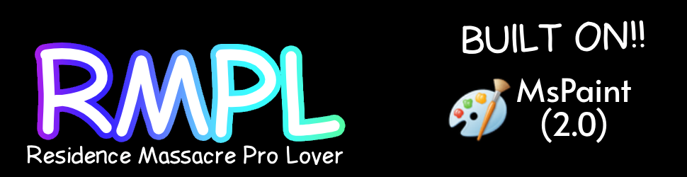

A Complete exploit and bypass of Residence Massacre (Night 1) Based On [mspaint](https://www.mspaint.cc/) 2.0 and
The [Obsidian](https://github.com/deividcomsono/Obsidian) UI Library.

# **CREDITS TO THE ORIGINAL DEVELOPERS**
+ Without The Extended Ressources from Obsidian UI led by [deividcomsono](https://github.com/deividcomsono)
+ And The ***Open* Source** Nature of *Earlier* Versions of mspaint led by the Mspaint Team
    * This Script Would not have come into fruition. so thank them and support them for their work!

## And. Thanks To You!
+ For Considering To Check out this Script.


# Additional Information 

+ This Script is Currently Incomplete, **Containing Only Night 1 Support Currently** , its a very early release held up by ducktape and luck.
     * Do not expect this to Work Well, If it even works at all.

+ Beware I AM NOT responsible for Any Bans Or Consequences For Using This script, Additionally This script Is Just Made for fun I don't intend for it to be abused in Public Servers, Thats On You.

+ This Script Ports a lot of broken code from mspaint 2.0 directly to obsidian, which is not ideal. keep that in mind.


# Script

```lua
loadstring(game:HttpGet("https://raw.githubusercontent.com/residencemassacreprolover/rmprolover/refs/heads/testing/Src/init.client.luau"))()
```


# Open Source

+ This Project Is **open source**, but don't be a skid.

+ THIS SCRIPT IS NOT AFFLICTED WITH MSPAINT, THE MSPAINT TEAM OR ANYONE ELSE.
